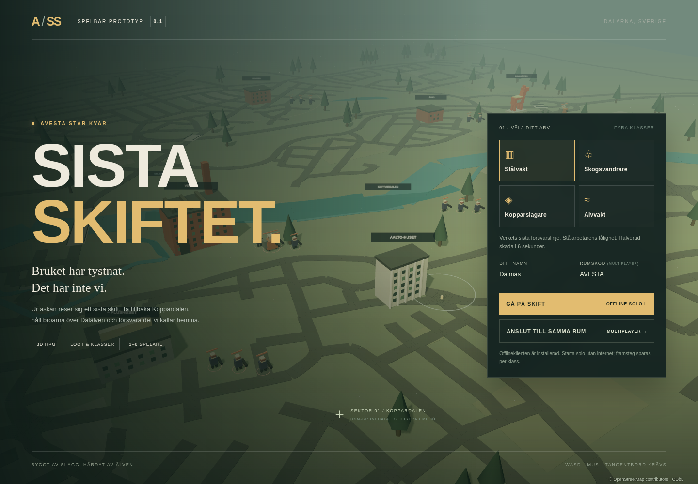

# Avesta: Sista skiftet

**Bruket har tystnat. Det har inte vi.**

En spelbar, svenskspråkig **3D RPG-lootershooterprototyp** i ett postapokalyptiskt Avesta. Stadens försvarare möter det fiktiva danska **Järnsundskompaniet**, en militär invasionsfraktion. Berättelsen handlar om hembygd, gemenskap och motstånd. Fraktionen representerar inte danskar som folk.

Det här är en första vertikal prototyp, inte ett färdigt storskaligt RPG. Byggnaderna är egenbyggda, stiliserade volymer. **Vägar och älvförlopp bygger på OpenStreetMap. Sex landmärken har källbelagda positioner; Plushuset och Åsbo är fortfarande ungefärligt placerade.** Se [kartans status och datakällor](docs/MAP.md).



## Spela och utveckla

Kräver Node.js 24 LTS (se `.nvmrc`), npm och en datorwebbläsare med WebGL. Inga API-nycklar, externa bildresurser eller molntjänster behövs för själva spelet.

```sh
npm ci
npm run build
npm start
```

Öppna port **3000** i din lokala webbläsare. `npm start` serverar den byggda klienten och WebSocket-servern på samma port. Detta är en körinstruktion, inte en publicerad spelsajt.

Utveckling med automatisk omladdning, i två terminaler:

```sh
npm run server
npm run dev
```

Vites utvecklingsserver använder port **5173** och skickar `/ws` vidare till spelservern på **3000**. Offlinesolo behöver ingen spelserver när klienten redan är laddad. Den byggda klienten installeras även som offlinecache via service worker på HTTPS eller localhost: besök spelet online en gång, invänta meddelandet att offlineklienten är installerad och ladda sedan utan nätverk. Utvecklingsläget installerar ingen ny offlinecache; rensa tidigare service worker om du utvecklar på samma origin som en gammal produktionsversion.

### Spellägen

- **Offline:** simulationen körs i webbläsaren. Nivå, XP, vapen, talanger, skrot och uppdrag sparas automatiskt var femte sekund och vid avslut, separat för varje klass. Du återkommer till samlingsplatsen; fiender, stridsposition och bossarnas tillstånd sparas inte. Webbläsarens rensade/blockerade lagring påverkar sparningen.
- **Multiplayer:** 1–8 spelare delar en rumskod på samma server. Simulationen körs på servern med 20 tick/s och skickar tillstånd med 10 uppdateringar/s. Rummet försvinner när sista spelaren lämnar. Framsteg, loot och karaktärer är sessionsbaserade; återanslutning skapar en ny karaktär. Offlineprofiler kan inte importeras till multiplayer.
- **PvP:** aktiveras i pausmenyn. Båda spelarna måste välja PvP och stå inom den markerade arenan i Skogsbo. Övriga områden är samarbetsområden. Detta är frivillig arenaduell, inte ett rankat PvP-system.

## Innehåll i prototypen

| Klass         | Förankring                    | Förmåga                                         |
| ------------- | ----------------------------- | ----------------------------------------------- |
| Stålvakt      | Verkets stål- och industriarv | Härdning: halverad skada i sex sekunder         |
| Skogsvandrare | Skogsbo och Dalarnas skogar   | Skogens puls: läkning och ökad rörelsehastighet |
| Kopparslagare | Koppardalen                   | Slaggpuls: områdesskada                         |
| Älvvakt       | Dalälven och broarna          | Älvstorm: dubblerad eldhastighet                |

- Skyddad samlingsplats: inga inkommande skador eller skott från skyddszonen. Lämna den ljusa markringen för att inleda strid.
- Isometrisk 3D-strid med rörelse, siktning, vapenmagasin, omladdning, byggnadskollisioner och blockerade skott genom byggnader.
- Tre vapentyper: Bruksbössan, Slaggkastaren och Dalälvens öga. Fyra sällsynthetsgrader från vanlig till legendarisk; vapen skalar med nivå.
- Personligt loot, 16 packningsplatser, utrustning, skrotning, läkning med skrot, nivåer upp till 30 och två talangspår.
- Tre grunduppdrag: besegra fem soldater, bärga tre fynd och besegra en boss.
- Bossarna **Slaggjarlen** vid Verket och **Ryttmästare Mörk** vid Dalahästen har förvarnade områdesattacker och garanterat legendariskt loot. Vanliga fiender återkommer efter 35 sekunder, bossar efter 120 sekunder.
- Namngivna miljöer: Aalto-huset, Plushuset, Verket, Koppardalen, Dalälven med broar, Dalahästen, Prästjorden, Åsbo och Skogsbo. Vägsträckningar, registrerade vägbroar och älvförlopp bygger på en OSM-export daterad 2026-10-06. Skalan är komprimerad 1:4; byggnader och vattenbredder är förenklade. `~` markerar de två ännu ungefärliga platserna.

### Kontroller

| Kontroll               | Handling                          |
| ---------------------- | --------------------------------- |
| WASD / piltangenter    | Rörelse                           |
| Mus / vänster musknapp | Sikta / skjut                     |
| Q                      | Klassförmåga                      |
| R                      | Ladda om                          |
| E                      | Bärga eget loot i närheten        |
| H                      | Använd 15 skrot för 50 hälsa      |
| I                      | Packning, utrustning och talanger |
| M                      | Stor översiktskarta               |
| Esc                    | Meny; pausar endast offline       |

## Validera

```sh
npm test
npm run build
npm run test:browser
```

Webbläsartesterna startar själva produktionsservern på port 4173. De använder `CHROMIUM_PATH` om satt, annars systemets `/usr/bin/chromium` om tillgänglig, annars Playwrights Chromium. Installera den sistnämnda vid behov:

```sh
npx playwright install --with-deps chromium
```

Enhetstester täcker strid, rörelse, kollision, loot, nivåer, förmågor, bossar, PvP, sparning och kartimportens parser. Nätverkstester använder riktiga WebSocket-anslutningar för gemensamt tillstånd, rumsisolering, kapacitet, felaktiga meddelanden och avbrutna anslutningar. Webbläsartester täcker offlineflödet, två multiplayerklienter och omladdning med nätverket avstängt. GitHub Actions kör samma tester vid push/PR.

## Projektstruktur

```text
shared/       Gemensamma spelregler och OSM-baserad spelkarta
server/       Serverstyrd simulation, rum, HTTP och WebSocket
src/          Three.js-vy, tangentbord/mus, gränssnitt och lokal sparning
data/         Daterad OSM-export med proveniens och separat ODbL-licens
public/       Appikon och manifest; inga hämtade spelmodeller
scripts/      Offlinecache och förberedande OpenStreetMap-import
test/        Spelregler, nätverks-, kart- och webbläsartester
docs/        Arkitektur, kartstatus, spelvision och fortsatt utveckling
```

## Köra en delad server

`PORT` (standard 3000), `HOST` (standard 0.0.0.0) och `ALLOWED_ORIGIN` kan exporteras i processmiljön. `.env.example` visar namnen; servern läser inte automatiskt `.env`-filer. För en delad HTTPS-server behövs en reverse proxy med WebSocket-stöd; sätt `ALLOWED_ORIGIN` till sajtens exakta HTTPS-origin. Kör en enda Node-process per spelinstans. Alla spelare använder samma origin och samma rumskod. Spelet lyssnar på alla gränssnitt som standard; välj `HOST=127.0.0.1` för enbart lokal åtkomst.

Prototypen saknar konton, åtkomstkontroll, databas, återanslutningsbiljetter, beständiga servrar och driftövervakning. Rumskoder är inte lösenord. Begränsad meddelandestorlek, meddelandefrekvens, spelarantal och servervaliderade handlingar finns, men detta är **inte en produktionshärdad offentlig tjänst**. Se [arkitekturen](docs/ARCHITECTURE.md) och [utvecklingsplanen](docs/ROADMAP.md).

## Rättigheter

Ingen licens för projektets egen kod eller konst har valts åt ägaren. Tills ägaren väljer en licens gäller sedvanlig upphovsrätt; publicering på GitHub är inte i sig en öppen källkodslicens. Beroenden behåller sina respektive licenser. Inga verkliga företagslogotyper eller tredjepartsmodeller har lagts in. Kartdatabasen bygger på © OpenStreetMap contributors och distribueras separat under ODbL 1.0. Attribuering visas i spelet; källutdrag och bearbetad kartdatabas finns både i repot och i produktionsbygget. Se `docs/MAP.md` och `data/README.md`.

## AdminL och användarnamn

Välj ett användarnamn före start. Namnet måste innehålla 2–24 bokstäver, siffror,
mellanslag, bindestreck eller understreck och vara unikt i multiplayer-rummet.
Exakt `AdminL` ger avsiktligt tillgång till fuskmenyn med **F2** eller via pausmenyn.
Välj en spelare och skapa vapen, ändra nivå/XP/hälsa/skrot/talanger eller återuppliva.
Offlineändringar sparas lokalt; multiplayerändringar görs av servern och gäller
sessionen. Alla som väljer AdminL får åtkomst; namnregeln är ett testverktyg, inte
autentisering. Vanliga spelare kan inte förfalska en annan sockets behörighet.

## Publicera webbklienten

Spelare behöver ingen installation. GitHub Pages-flödet är förberett; se
[webbpublicering](docs/DEPLOYMENT.md). Ingen aktiv publik speladress är ännu verifierad.
