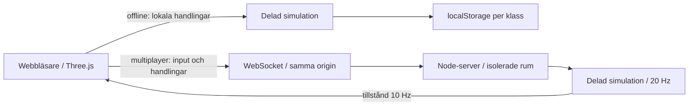

# Arkitektur

Klienten renderar spelvärlden med Three.js. `shared/game.js` är en DOM-fri simulation som används både av offlinespelaren och Node-servern. Klienten skickar rörelse/siktning och begär handlingar; den skickar inte position, träffresultat, skada, inventarie eller XP som servern accepterar.

## Kontrakt

- `join`: rumskod, visningsnamn, klass. Servern genererar spelar-ID och alla startvärden.
- `input`: x/z i intervallet −1…1, siktningsvinkel och boolesk avfyrning. Rörelse normaliseras; NaN, Infinity och oväntade typer neutraliseras. Utebliven input i 500 ms stoppar rörelse/avfyrning.
- `action`: omladdning, klassförmåga, loot, utrustning, skrotning, läkning, talang, PvP-val eller återkomst efter död. Servern kontrollerar ägarskap, avstånd, saldo, hälsa och nedkylning.
- `welcome` / `state`: serverns tillstånd. Renderingen interpolerar enheter visuellt. Klientprediction, rollback och laggkompensation är inte implementerade; hög latens märks i spelkänslan.
- Max åtta spelare per rum, 32 rum, 256 anslutningar, 2 KiB per meddelande och 100 klientmeddelanden/s. Ej anslutna spelare stängs efter 10 sekunder. Rumsdata rensas när alla anslutningar stängts.
- Kontroller av browser-origin är same-origin, eller det uttryckliga `ALLOWED_ORIGIN` bakom HTTPS-proxy. Detta ersätter inte autentisering. I lokalt läge tillåts verktyg utan Origin-header.

Servern skickar rummets tillstånd till alla deltagare. Servern avgör träffar och progression, men klienter kan läsa fiendepositioner och andra spelares tillstånd. Det finns inget fullständigt anti-cheat eller dolt informationslager. Kollisions- och siktlinjetester använder samma förenklade byggnadsytor i båda spellägena. Träd, dekor och rök är visuella; terrängen är plan och byggnader kan inte beträdas. AI går direkt mot mål och kan fastna bakom byggnader; navmesh/pathfinding är nästa steg.

## Sparning

Offline sparas versionerat JSON under `avesta-save-v1-<klass>`. Vapenstatistik rekonstrueras från typ/sällsynthet/nivå när sparningen läses; trasiga poster ignoreras. Offlineprofilen är användarägd och kan ändras i webbläsaren, vilket är en anledning till att den aldrig laddas in i multiplayer. Lagerutrymmesfel visas i gränssnittet.

Multiplayer är flyktig och har ingen databas. En WebSocket-reconnect skapar en ny karaktär. Publicering av molnmiljön sparar filer och installerade beroenden, inte pågående matcher eller serverprocesser.

## Offlineleverans

`npm run build` skapar klienten och en innehållsversionerad service worker som precachar alla byggresurser. Ingen CDN används. När den cachelagrade produktionsklienten har laddats en gång på en säker origin kan den laddas om utan internet. `/health` och `/ws` cachas inte. Uppdaterade service workers aktiveras efter att den gamla klientens flikar stängts. Lokalt sparade karaktärer ligger utanför cachen och påverkas inte av en cacheuppdatering.

## Utvecklingsmiljö

Node 24, låsta npm-beroenden, Chromium och vanliga shellverktyg räcker. npm-cache och lokala testartefakter ligger i `.local/` och versionshanteras inte. Inga hemligheter behövs. Molnuppgifter har redan isolerade utcheckningar; använd befintlig utcheckning och skapa inte Git-worktrees om det inte uttryckligen efterfrågas.

## Kartdata

`data/avesta-osm.json` innehåller det daterade OSM-utdraget. `node scripts/build-map.js` projicerar det deterministiskt till `shared/geography.json`. `shared/map.js` använder samma vägar, vatten och landmärken på klient och server. Geografiska avstånd komprimeras 1:4. Vattenytor används där de finns; älvlinjer får förenklade bredder. Vägbroar tillåter passage genom vattenkollisionen. Sex landmärkespositioner kommer från OSM; två är märkta som ungefärliga. Byggnadsmodellerna är fortfarande tolkningar.
